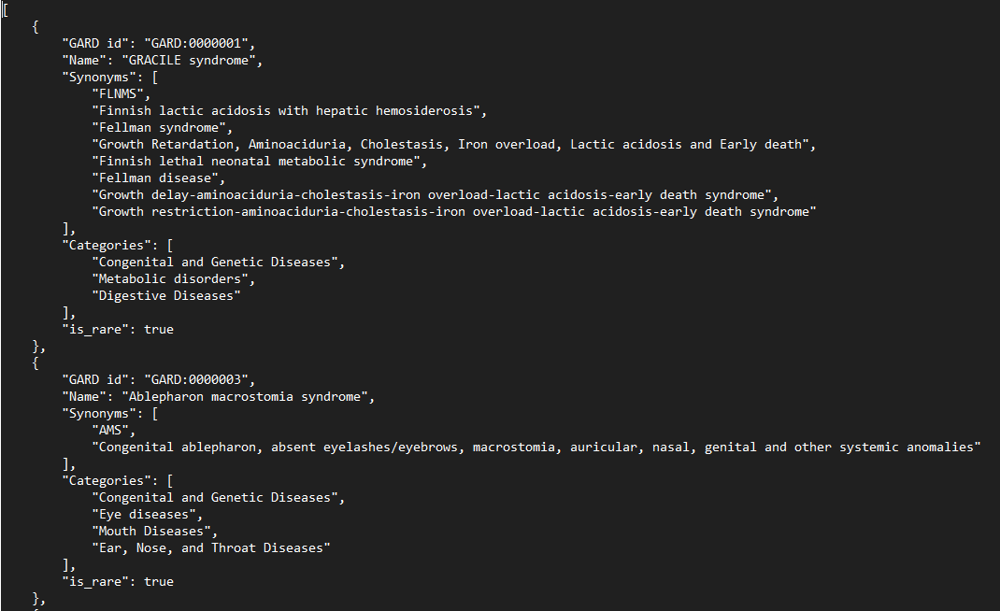

# Introduction
NormMap V2 is a python based package which maps a specific data source to a rare disease(s). NormMap V2 is the second version of NormMap which features several improvements from the previous algorithm such as parallel processing and different mapping methods such as using the `SpaCy` PhraseMatcher package 


## Required packages
```
pandas==1.4.2
spacy==3.2.1
nltk==3.6.7
```
NormMap V2 uses the SpaCy's `en_core_web_lg` language model and will also have to be installed
```
python -m spacy download en_core_web_lg
```
NormMap V2 also uses NLTK's WordNetLemmatizer for lemmatization. But the data used for this is already automatically downloaded upon running NormMap V2
```
nltk.download('wordnet')
nltk.download('omw-1.4')
```

## Accepted input file types
### Abstract Mapper
#### Rare Disease Data
- json
#### Data to map to rare diseases
- txt (seperated by tabs)
- csv
- xlsx
### Subreddit Mapper
#### Rare Disease Data
- json
#### Data to map to rare diseases 
- json

## Expected structure of input data
### Abstract data
CSV, Excel, or TXT format only

`IDcol` is the unique identifier column for the text
`TEXTcols` is all the column names in a list that contain the text you want to search for rare diseases in
### Subreddit data
List of lists, each list only contains 2 elements, the first being the subreddit text, and the second being a python dictionary of metadata 
### Rare Disease data
Retrieved from https://disease.ncats.io

Only accepts JSON data. A list of Python dictionaries. The only data that is used by the current NormMap V2 algorithm is `GARD id`, `Name` and `Synonyms`


## Matching with NormMap V2
### Importing the class
```from AbstractMap import AbstractMap```
OR
```from RedditMap import RedditMap```

The only function you will need to match is `_match()` once the specific object is instantiated
For example if you wanted to match with Abstract data:
```
map = AbstractMap()
map._match('abstracts.csv','disease_list.json')
```
Parameter 1 is the file you want to be mapped and parameter 2 is the rare disease data

```
map = AbstractMap()
map._match('abstracts.csv','disease_list.json', IDcol='col0', TEXTcols=['col1','col2','col3','col4'])
```
`IDcol` is an optional parameter that lets you set the column to be used as a unique identifier
`TEXTcols` is an optional parameter that lets you set the the column OR columns to be used as the text to be processed

DEFAULT COLUMNS ARE `Application_ID` for the unique identifier column and `Abstract` for the text column

## Adding different types of data to be mapped
Part of NormMap V2's improvements is the ability to easily expand different types of data beyond Abstract and Subreddit data. To do this you will need to make another class and have it inherit the `Map` class and override the `_match()` method and use the inherited methods from the `Map` for normalization and matching

# Source Code
## `bin` folder
Contains the NormMap V2 python code as well as all the data
## `data` folder
Store both the input and output data
## `input` folder
Stores the data used to map. The rare diseases list necessary for mapping comes from Neo4j data lake at https://disease.ncats.io
## `output` folder
Stores all output from NormMap V2
## `doc` folder
Contains all of the documentation for NormMap V2. More detailed documentation is stored [here](doc/Mapper_Description.docx)
## `img` folder
Contains images for documentation purposes
## `__init__.py`
Placeholder and example file that can be used to run the mapping process
## `Map.py`
Parent class of all NormMap V2 classes. Contains all of the shared methods between all the children
## `AbstractMap.py`
Specific mapping class used for Abstract (scientific article) data
## `RedditMap.py`
Specific mapping class used for subreddit data
## `FalsePositives.py`
Object used to store all of the false positives that will be ignored when mapping
